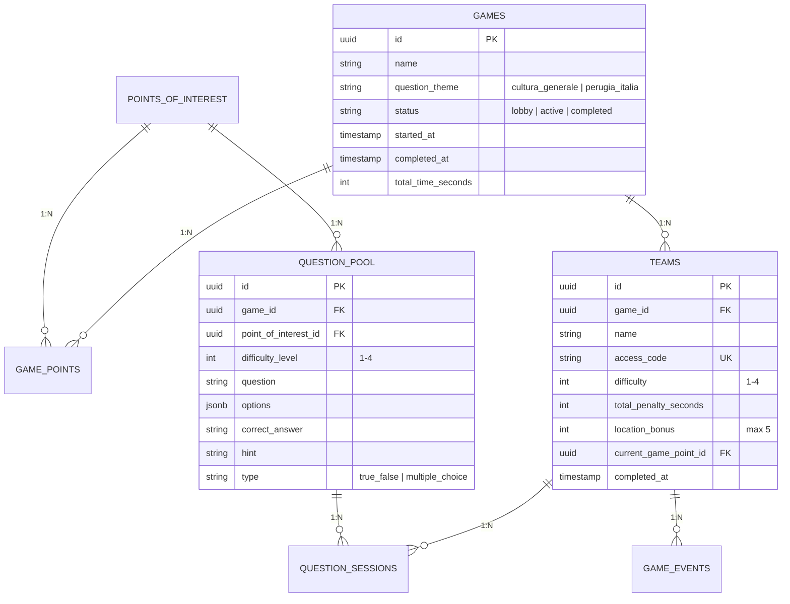

# Software Requirements Specification (SRS)
## Escape Room Outdoor — Perugia

---

**Documento:** SRS-001
**Versione:** 3.0
**Data:** 3 Giugno 2026
**Committente:** [AS GAIA](https://www.asgaia.it/)
**Gruppo di Lavoro:**
- Giacomo Alfano (Curatore Contenuti / Ricercatore di Zona -- Gestore Progetto)
- Valentin Racovita (Sviluppatore Frontend)
- Vitaly Didyk (Sviluppatore Pannello di Amministrazione)
- Boluwaji Oluwaseyi Adepoju (Sviluppatore Backend -- Ingegneria dei Prompt)
**Metodologia:** Agile (Scrum)

---

### Indice

1. [Introduzione](#1-introduzione)
   - 1.1 Scopo
   - 1.2 Ambito del Prodotto
   - 1.3 Definizioni, Acronimi e Abbreviazioni
   - 1.4 Riferimenti
   - 1.5 Panoramica del Documento
2. [Descrizione Generale](#2-descrizione-generale)
   - 2.1 Prospettiva del Prodotto
   - 2.2 Funzionalità del Prodotto
   - 2.3 Caratteristiche degli Utenti
   - 2.4 Vincoli Generali
   - 2.5 Assunzioni e Dipendenze
3. [Requisiti Specifici](#3-requisiti-specifici)
   - 3.1 Requisiti Funzionali — User Stories
   - 3.2 Requisiti Non Funzionali
   - 3.3 Requisiti di Dominio
   - 3.4 Casi d'Uso Testuali (principali)
4. [Modello del Dominio](#4-modello-del-dominio)
5. [Criteri di Accettazione](#5-criteri-di-accettazione)
6. [Appendici](#6-appendici)

---

### 1. Introduzione

#### 1.1 Scopo

Il presente documento costituisce la Specifica dei Requisiti Software per il sistema **"Escape Room Outdoor — Perugia"**, un'applicazione mobile-first volta a trasformare il centro storico del capoluogo umbro in un'esperienza ludica interattiva a squadre. I partecipanti, organizzati in gruppi dotati di punti di partenza assegnati in maniera casuale, navigano mediante GPS, rispondono a quesiti secondo la modalità Kahoot allorquando accedono al raggio di attivazione dei punti di interesse, e competono **simultaneamente** in una gara cronometrata.

Il software è commissionato dall'azienda **AS GAIA** (www.asgaia.it) per lo svolgimento di attività di team building e di turismo esperienziale.

Il presente SRS è redatto conformemente allo standard **IEEE 830-1998** e ai criteri di qualità enunciati da Sommerville (correttezza, completezza, non ambiguità, consistenza, verificabilità, modificabilità, tracciabilità). Esso funge da riferimento per l'intero ciclo di vita del prodotto: progettazione, implementazione, verifica e manutenzione.

#### 1.2 Ambito del Prodotto

Il sistema comprende tre componenti principali:

| Componente | Descrizione | Tecnologia |
|------------|-------------|------------|
| **PWA Giocatore** | Progressive Web App per dispositivi mobili. Consente la navigazione GPS, lo sblocco di domande mediante geofence, la risposta a tempo, la visualizzazione della classifica in tempo reale e il recupero della geolocalizzazione. | Next.js, React, Leaflet.js, Tailwind CSS/DaisyUI, Zustand |
| **Pannello Operatore** | Interfaccia desktop destinata al soggetto incaricato della gestione dell'escape room il giorno dell'evento: posizionamento dei POI su mappa, selezione del tema delle domande, creazione delle squadre, avvio e arresto della partita, monitoraggio in tempo reale. Progettato per utenti privi di competenze tecniche. | Next.js (medesima codebase) |
| **Backend Serverless** | Logica di gioco, generazione automatica delle domande, validazione delle risposte con timer, comunicazione real-time, anti-cheat GPS, calcolo della classifica cronometrata. | Supabase (PostgreSQL, Edge Functions/Deno, Realtime, Storage) |

**Esclusioni dall'ambito:**
- Applicazioni native per piattaforme iOS e Android (la PWA risulta sufficiente)
- Integrazione con social network
- Sistema di pagamento
- Realtà aumentata (AR)
- Persistenza dei dati oltre la durata della partita

#### 1.3 Definizioni, Acronimi e Abbreviazioni

| Termine | Definizione |
|---------|-------------|
| **PWA** | Progressive Web Application — applicazione web installabile su dispositivi mobili, con supporto offline |
| **GPS** | Global Positioning System — sistema di posizionamento geografico satellitare |
| **Geofencing** | Tecnica che definisce un'area virtuale circolare (raggio configurabile) intorno a coordinate GPS reali |
| **RLS** | Row Level Security — meccanismo di sicurezza a livello di riga in PostgreSQL |
| **Edge Function** | Funzione serverless eseguita on-demand sul backend Supabase, runtime Deno/TypeScript |
| **GDPR** | General Data Protection Regulation — Regolamento UE 2016/679 |
| **Bivio Mistico** | Meccanica di gioco in cui la squadra vota un simbolo per scegliere il percorso successivo senza conoscere la destinazione |
| **SRS** | Software Requirements Specification — questo documento |
| **RTM** | Requirements Traceability Matrix — matrice di tracciabilità dei requisiti |
| **UML** | Unified Modeling Language — linguaggio di modellazione per diagrammi software |
| **POI** | Point of Interest — punto di interesse geolocalizzato sulla mappa di gioco |
| **LLM** | Large Language Model — modello linguistico per la generazione automatica di domande |

#### 1.4 Riferimenti

| Rif. | Documento | Descrizione |
|------|-----------|-------------|
| [1] | RTM.md | Requirements Traceability Matrix |
| [2] | UML.md | UML Design Document |
| [3] | USERSTORY.md | 33 User Stories con checklist e note tecniche |
| [4] | DOCUMENTAZIONE_TECNICA.md | Documentazione tecnica del sistema |
| [5] | SPECIFICA_CLIENTE.md | Specifica del Committente AS GAIA |
| [6] | PIANO_SVILUPPO.md | Piano di sviluppo incrementale |
| [7] | IEEE 830-1998 | Standard per SRS |

#### 1.5 Panoramica del Documento

- **Sezione 1:** Introduzione e contesto
- **Sezione 2:** Descrizione generale del prodotto, utenti, vincoli, assunzioni
- **Sezione 3:** Requisiti specifici (funzionali con priorità, non funzionali con metriche, di dominio)
- **Sezione 4:** Modello del dominio
- **Sezione 5:** Criteri di accettazione
- **Sezione 6:** Appendici (stack tecnologico, glossario)

---

### 2. Descrizione Generale

#### 2.1 Prospettiva del Prodotto

Il sistema si configura come un'applicazione standalone la quale interagisce con servizi esterni per la cartografia, la generazione di contenuti e la persistenza temporanea dei dati. L'architettura adottata è di tipo **3-tier**: livello di presentazione (PWA), livello di logica applicativa (Edge Functions), livello dati (PostgreSQL con gestione effimera delle informazioni).

**Interfacce esterne:**
- **Dispositivi mobili:** browser web con supporto GPS e Service Worker
- **Groq API:** generazione di domande in italiano tramite LLM
- **Pollinations.ai:** verifica visiva delle foto
- **OpenStreetMap:** tile cartografiche per mappa interattiva
- **Supabase:** database PostgreSQL, WebSocket Realtime, Storage file audio

#### 2.2 Funzionalità del Prodotto

| Macro-Funzione | Descrizione | User Stories |
|----------------|-------------|--------------|
| **Navigazione GPS** | Mappa interattiva con posizione in tempo reale; recupero automatico se il giocatore si allontana dall'area corretta | US1, US7 |
| **Geofencing** | Sblocco automatico di domande quando la squadra entra nel raggio (30-50m configurabili) | US2 |
| **Domande a Tempo** | Domande in stile Kahoot con limite di 10 secondi; risposta sbagliata = +10s penalità + nuova domanda | US3, US6, US9, US29, US32 |
| **Scelta Tema Domande** | L'operatore sceglie tra cultura generale e domande su Perugia/Italia | US5 |
| **Gara a Cronometro** | Timer parte all'avvio operatore e si ferma quando tutte le squadre completano o l'operatore stoppa; classifica per tempo | US4, US14, US15 |
| **Bonus Tappe** | -1 secondo dal tempo totale per ogni tappa completata (massimo -5 secondi) | US29 |
| **Partenza Casuale** | Ogni squadra parte da un POI diverso, assegnato casualmente | US31 |
| **Bivio Mistico** | Votazione al buio su simboli; maggioranza determina il percorso; spareggio in parità | US28, US33 |
| **Verifica Foto** | Scatto fotografico del monumento con verifica entro 3 secondi | US25 |
| **Audio-Guida** | Narrazione audio automatica all'arrivo (max 60s) | US26 |
| **Anti-Cheat GPS** | Rilevamento velocità anomala (>50 m/s) | US19 |
| **Classifica Effimera** | Classifica visibile solo durante la partita; nessun dato salvato dopo | US4, US22 |
| **Pannello Operatore** | Interfaccia per l'operatore che gestisce l'evento: posiziona POI, sceglie tema, crea squadre, avvia/ferma partita, monitora | US5, US10, US13 |
| **Login Atmosferico** | Accesso con codice squadra, sfondo Perugia, animazione porta | US30 |
| **Offline Resilience** | Domande visibili senza connessione dopo lo sblocco; mappe in cache | US21, US23 |
| **Ottimizzazione Batteria** | Polling GPS ogni 10 secondi, cache dati | US11 |
| **Persistenza Sessione** | Recupero stato dopo crash/chiusura browser | US12 |

#### 2.3 Caratteristiche degli Utenti

| Ruolo | Descrizione | Competenze | Interfaccia |
|-------|-------------|------------|-------------|
| **Giocatore** | Partecipa all'esperienza. Naviga, risponde a domande, interagisce con la squadra. | Nessuna competenza tecnica. | PWA mobile |
| **Caposquadra** | Configura la squadra: nome, colore, difficoltà. | Come il Giocatore. | PWA mobile — setup |
| **Operatore** | Il soggetto incaricato della conduzione dell'escape room il giorno dell'evento. Provvede al posizionamento dei POI sulla mappa, alla selezione del tema delle domande, alla creazione delle squadre, all'avvio e all'arresto della partita, nonché al monitoraggio dell'andamento. Non sono richieste competenze tecniche avanzate. | Familiarità di base con interfacce web e mappe. | Pannello Operatore desktop |

#### 2.4 Vincoli Generali

| Categoria | Vincolo |
|-----------|---------|
| **Stack** | Next.js 16, React 19, Tailwind CSS 4, DaisyUI 5, Leaflet.js, Zustand, Supabase |
| **Lingua** | Italiano (interfaccia e contenuti) |
| **Target** | Smartphone con GPS, browser moderno (Chrome/Safari/Firefox) |
| **Hosting** | Vercel (frontend), Supabase Cloud (backend) |
| **Metodologia** | Agile (Scrum) con sprint su Trello; Git flow su GitHub |
| **Partita Singola** | Solo una partita attiva per volta; parte quando tutte le squadre sono entrate |

#### 2.5 Assunzioni e Dipendenze

| # | Assunzione | Impatto se non soddisfatta |
|---|-----------|---------------------------|
| A1 | Dispositivo con GPS e connessione internet | Gioco non funzionante |
| A2 | Groq API raggiungibile entro 5s | Fallback a domande placeholder |
| A3 | OpenStreetMap accessibile | Mappa non visibile (mitigato da cache PWA) |
| A4 | Browser supporta Service Worker | Funzionalità offline non disponibili |
| A5 | Supabase Realtime operativo | Classifica non aggiornata in tempo reale |

---

### 3. Requisiti Specifici

#### 3.1 Requisiti Funzionali — User Stories

**Priorità:** M Must Have | S Should Have | C Could Have | W Won't (questa iterazione)

##### Gioco — Navigazione e Sblocco

| ID | User Story | Priorità |
|----|------------|----------|
| **US1** | Come giocatore, voglio vedere la mia posizione GPS su una mappa interattiva per orientarmi. | M |
| **US2** | Quando la squadra entra nell'area di attivazione (30-50m), la domanda viene sbloccata per tutti i membri. | M |
| **US7** | In caso di segnale GPS assente, l'app mostra "Avvicinati a una zona aperta". Se il giocatore si allontana dall'area obiettivo, il GPS fornisce indicazioni per rientrare. | S |

##### Gioco — Domande e Risposte

| ID | User Story | Priorità |
|----|------------|----------|
| **US3** | Come giocatore, voglio rispondere a domande in stile Kahoot. Ho 10 secondi per rispondere. Se sbaglio, ricevo +10 secondi di penalità e una nuova domanda (diversa). Se rispondo correttamente, passo alla tappa successiva e ottengo -1s di bonus sul tempo totale. | M |
| **US6** | Come operatore, voglio che le domande siano generate automaticamente e siano tutte diverse per ogni squadra. | M |
| **US9** | Come giocatore, posso chiedere un suggerimento se non capisco la domanda (max 2-3 per tappa). | S |
| **US29** | Come giocatore, voglio essere premiato per la velocità: ogni tappa completata riduce il tempo totale di 1 secondo (massimo -5 secondi totali). | S |
| **US32** | Ogni zona richiede 5 domande generate automaticamente; completate tutte, la zona è risolta e si sblocca il percorso successivo. | M |

##### Gioco — Classifica e Competizione

| ID | User Story | Priorità |
|----|------------|----------|
| **US4** | Come giocatore, voglio vedere la classifica in tempo reale basata sul tempo totale. La classifica esiste solo durante la partita; nessun dato viene salvato dopo. | M |
| **US14** | La classifica mostra la mia squadra evidenziata rispetto alle altre. | M |
| **US15** | La classifica si aggiorna via WebSocket entro 2 secondi da ogni evento, senza refresh manuale. | M |

##### Gioco — Meccaniche Avanzate

| ID | User Story | Priorità |
|----|------------|----------|
| **US8** | Quando un membro risolve una domanda, tutti i dispositivi della squadra ricevono l'aggiornamento entro 2 secondi. | M |
| **US25** | Come giocatore, posso scattare una foto al monumento per verifica automatica (risposta entro 3s). | S |
| **US26** | All'arrivo in una tappa, parte una narrazione audio (max 60s) sulla storia del luogo. | C |
| **US27** | Chat rapida di squadra per coordinarsi durante il gioco (messaggi cancellati a fine partita). | C |
| **US28** | Dopo un bivio, la squadra può scegliere tra percorsi diversi che portano a tappe differenti. | M |
| **US33** | Bivio Mistico: tre simboli, votazione al buio, maggioranza decide il percorso; spareggio in parità. | M |

##### Gioco — Resilienza e Performance

| ID | User Story | Priorità |
|----|------------|----------|
| **US11** | L'app consuma poca batteria (polling GPS ogni 10s, cache, luminosità adattiva). | C |
| **US12** | Se l'app crasha, il giocatore recupera la sessione alla riapertura. | S |
| **US19** | Il sistema rileva spostamenti GPS sospetti (>50 m/s) e marca la squadra. | S |
| **US21** | Le tile della mappa sono in cache; consumo dati < 5 MB/ora. | C |
| **US22** | I dati GPS e di gioco esistono solo durante la partita; nessuna persistenza dopo. | M |
| **US23** | Se internet cade, la domanda già sbloccata rimane visibile offline. | C |

##### Pannello Operatore

| ID | User Story | Priorità |
|----|------------|----------|
| **US5** | Come operatore, posiziono i punti di interesse sulla mappa con un click, scelgo il tema delle domande (cultura generale oppure Perugia e Italia), creo le squadre e avvio la partita quando tutti sono pronti. | M |
**US10** | L'operatore crea le squadre, assegna un codice di accesso univoco a ciascuna e imposta il livello di difficolta (1-4). | M |
| **US13** | L'operatore visualizza il log degli eventi in tempo reale per monitorare l'andamento della partita. | S |
| **US30** | Schermata di login con sfondo di Perugia, form centrato, animazione porta. | M |
| **US31** | Il caposquadra sceglie nome, colore e difficoltà; il sistema assegna un punto di partenza casuale diverso per ogni squadra. | M |

##### Funzionalità Future (non in questo sprint)

| ID | User Story | Priorità |
|----|------------|----------|
| **US16** | Schermata con spiegazione delle regole di punteggio. | W |
| **US17** | Badge e titoli per le squadre vincitrici. | W |
| **US18** | Schermata conclusiva con classifica finale e riepilogo. | W |
| **US20** | Percorsi accessibili senza barriere architettoniche. | W |
| **US24** | Votazione delle domande per migliorare la generazione futura. | W |

#### 3.2 Requisiti Non Funzionali

##### Performance

| ID | Requisito | Metrica |
|----|-----------|---------|
| **NFR-P1** | Attivazione geofence | < 2 secondi |
| **NFR-P2** | Generazione domanda | < 5 secondi |
| **NFR-P3** | Verifica foto | < 3 secondi |
| **NFR-P4** | Aggiornamento classifica | < 2 secondi dall'evento |
| **NFR-P5** | Timeout risposta giocatore | 10 secondi per domanda |
| **NFR-P6** | Caricamento iniziale PWA | < 3 secondi su rete 4G |

##### Affidabilità

| ID | Requisito | Metrica |
|----|-----------|---------|
| **NFR-R1** | Raggio attivazione GPS | 30-50 metri configurabili |
| **NFR-R2** | Tolleranza GPS | Funzionamento con ±15m di imprecisione |
| **NFR-R3** | Fallback generazione domande | Domanda generica predefinita se il servizio di generazione non risponde |

##### Sicurezza e Privacy

| ID | Requisito | Implementazione |
|----|-----------|----------------|
| **NFR-S1** | Protezione dati | Row Level Security su tutte le tabelle |
| **NFR-S2** | Nessuna persistenza | I dati di gioco esistono solo durante la partita |
| **NFR-S3** | Accesso squadre | Codice univoco (`access_code`) |
| **NFR-S4** | HTTPS | Obbligatorio su tutti gli endpoint |

##### Usabilità

| ID | Requisito | Implementazione |
|----|-----------|----------------|
| **NFR-U1** | Design responsive | Framework CSS responsive; testato su viewport 320px-1920px |
| **NFR-U2** | Elementi touch-friendly | Pulsanti ≥ 44px |
| **NFR-U3** | Feedback utente | Messaggi chiari per ogni azione |
| **NFR-U4** | Lingua | Tutta l'interfaccia in italiano |

#### 3.3 Requisiti di Dominio

| ID | Requisito |
|----|-----------|
| **D1** | Il gioco si svolge nel centro storico di Perugia |
| **D2** | Le domande possono riguardare cultura generale oppure storia, arte e geografia di Perugia e Italia |
| **D3** | Una sola partita attiva per volta |
| **D4** | La partita inizia solo quando tutte le squadre sono entrate |
| **D5** | Target: aziende (team building) e turisti |
| **D6** | Durata stimata: 60-90 minuti per 5-7 tappe |
| **D7** | Dimensione squadra: 3-6 partecipanti |

#### 3.4 Casi d'Uso Testuali

**UC-1: Risposta a Domanda con Timer**

| Campo | Dettaglio |
|-------|-----------|
| **Nome** | Risposta a domanda a tempo |
| **Attore** | Giocatore |
| **Precondizioni** | La squadra è entrata nel geofence; la domanda è stata sbloccata; il timer di partita è attivo |
| **Flusso Principale** | 1. Il sistema mostra la domanda con 4 opzioni. 2. Parte il countdown di 10 secondi. 3. Il giocatore seleziona una risposta. 4. Se corretta: Il sistema registra il completamento, assegna -1s bonus (max -5s cumulativi), sblocca la tappa successiva. 5. Se il tempo scade: +10s di penalità, nuova domanda. |
| **Flusso Alternativo** | 4a. Risposta sbagliata: +10s di penalità, il sistema mostra una nuova domanda (diversa). 4b. Tempo scaduto: +10s di penalità, nuova domanda. |
| **Postcondizioni** | La tappa è completata e la squadra avanza; oppure la penalità è applicata e una nuova domanda è presentata |

**UC-2: Avvio Partita**

| Campo | Dettaglio |
|-------|-----------|
| **Nome** | Avvio partita dall'operatore |
| **Attore** | Operatore |
| **Precondizioni** | Tutte le squadre hanno effettuato l'accesso; i POI sono configurati; il tema domande e selezionato |
| **Flusso Principale** | 1. L'operatore clicca "Avvia Partita". 2. Il sistema assegna casualmente un POI di partenza a ogni squadra. 3. Il sistema genera 5 domande per ogni POI (tutte diverse tra le squadre). 4. Il cronometro di partita parte. 5. Le squadre ricevono la notifica di inizio. |
| **Flusso Alternativo** | 2a. Se una squadra non ha ancora fatto login, il sistema notifica l'operatore. |
| **Postcondizioni** | Partita in stato `active`; cronometro avviato; tutte le squadre hanno un punto di partenza |

---

### 4. Modello del Dominio

---

### 5. Criteri di Accettazione

Il progetto si considera completato quando:

| # | Criterio | Evidenza |
|---|----------|----------|
| CA1 | Il timer di partita parte all'avvio operatore e si ferma quando tutte le squadre completano o l'operatore stoppa | Demo funzionante |
| CA2 | Ogni domanda ha un timeout di 10 secondi | Test con timer |
| CA3 | Risposta sbagliata produce +10s penalità e una nuova domanda diversa | Test con risposte errate |
| CA4 | Ogni tappa completata riduce il tempo totale di 1s (max -5s) | Verifica su 5+ tappe |
| CA5 | Squadre diverse partono da POI diversi e ricevono domande diverse | Confronto domande tra squadre |
| CA6 | La classifica è visibile solo durante la partita; nessun dato persiste dopo | Verifica assenza dati post-partita |
| CA7 | L'operatore puo scegliere tra cultura generale e domande su Perugia/Italia | Test con entrambi i temi |
| CA8 | Il GPS guida il giocatore verso l'area se si allontana | Test con coordinate simulate |
| CA9 | Il pannello operatore e utilizzabile da personale non tecnico per gestire l'intero evento | Test con utente non tecnico |
| CA10 | Tutte le 7 Edge Function deployate e funzionanti | Supabase Dashboard |

---

### 6. Appendici

#### 6.1 Stack Tecnologico

| Layer | Tecnologia |
|-------|-----------|
| **Frontend** | Next.js 16, React 19, Tailwind CSS 4, DaisyUI 5 |
| **Mappe** | Leaflet.js + React-Leaflet + OpenStreetMap |
| **Stato** | Zustand 5 |
| **PWA** | Serwist 9 |
| **Backend** | Supabase (PostgreSQL, Realtime, Storage, Edge Functions/Deno) |
| **Generazione Contenuti** | Groq API — Llama 3.3 70B Versatile |
| **Verifica Immagini** | Pollinations.ai |
| **Hosting** | Vercel (frontend), Supabase Cloud (backend) |
| **Strumenti** | VS Code, Git, Node.js, Trello |

#### 6.2 Glossario

| Termine | Definizione |
|---------|-------------|
| **Geofencing** | Area virtuale circolare intorno a coordinate GPS; l'ingresso attiva un evento |
| **Bivio Mistico** | Votazione al buio su simboli per determinare il percorso successivo |
| **Edge Function** | Funzione serverless Deno/TypeScript su Supabase |
| **RLS** | Row Level Security — policy PostgreSQL per accesso ai dati |
| **PWA** | Progressive Web App — installabile e funzionante offline |
| **Haversine** | Formula per calcolare la distanza tra due coordinate GPS sulla sfera terrestre |
| **Tema Domande** | Scelta operatore: cultura generale oppure Perugia/Italia |
| **Cronometro di Partita** | Timer globale che parte all'avvio e si ferma al completamento o stop operatore |

---

*Documento redatto dal Gruppo di Lavoro Escape Room Perugia per AS GAIA -- 3 Giugno 2026*
