# UML Design Document

## Escape Room Outdoor -- Perugia

---

**Documento:** UML-001
**Versione:** 2.0
**Data:** 20 Maggio 2026
**Committente:** AS GAIA
**Riferimento SRS:** SRS-001 v2.0

---

### Indice

1. [Diagrammi Use Case](#1-diagrammi-use-case)
2. [Diagramma delle Classi (Modello del Dominio)](#2-diagramma-delle-classi)
3. [Activity Diagram](#3-activity-diagram)
4. [Sequence Diagram](#4-sequence-diagram)
5. [State Machine Diagram](#5-state-machine-diagram)
6. [Component Diagram](#6-component-diagram)
7. [Deployment Diagram](#7-deployment-diagram)

---

### 1. Diagrammi Use Case

#### 1.1 Use Case – Giocatore

Il giocatore interagisce con il sistema di gioco durante una partita. Le operazioni disponibili coprono l'intero flusso: dall'accesso alla conclusione.

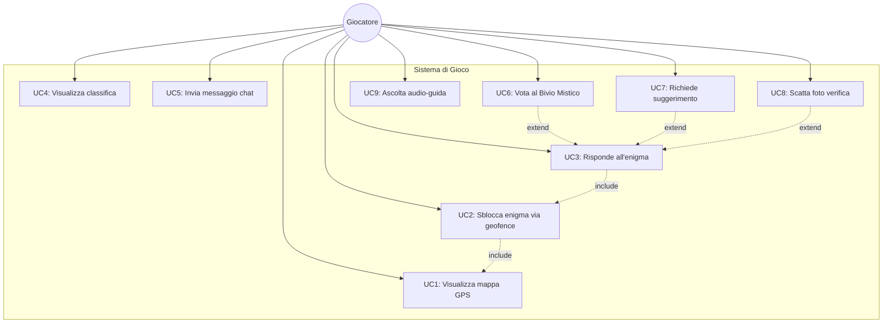

**Relazioni chiave:**
- **Include:** Lo sblocco dell'enigma (UC2) richiede la mappa GPS (UC1). La risposta (UC3) richiede lo sblocco (UC2).
- **Extend:** Voto (UC6), suggerimento (UC7) e foto (UC8) estendono opzionalmente la risposta all'enigma (UC3).

#### 1.2 Use Case -- Operatore

L'operatore (la persona che gestisce l'escape room il giorno dell'evento) configura l'esperienza di gioco tramite pannello desktop.

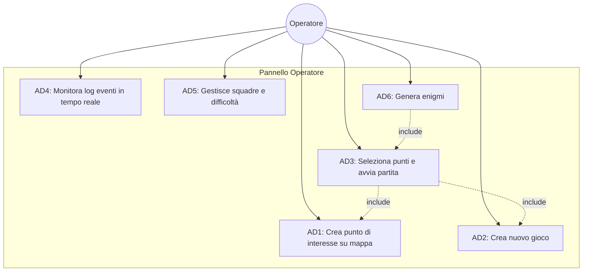

#### 1.3 Use Case – Sistema (Backend Automatico)

Il backend esegue operazioni automatiche senza intervento umano, garantendo il funzionamento del gioco e la conformità normativa.

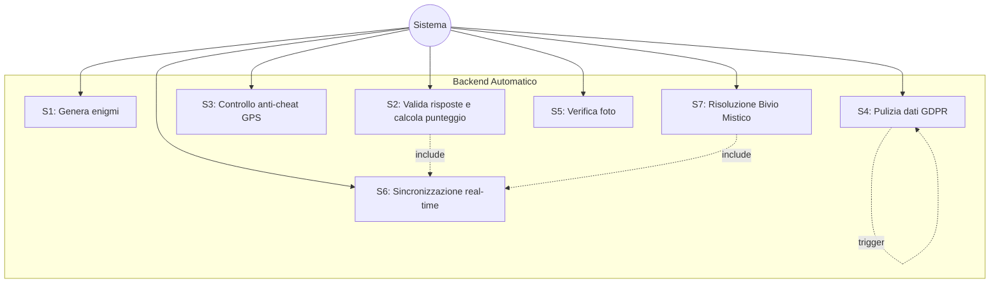

---

### 2. Diagramma delle Classi (Modello del Dominio)

Il diagramma rappresenta le entità principali del sistema e le loro relazioni, mappate direttamente sulle tabelle del database PostgreSQL.

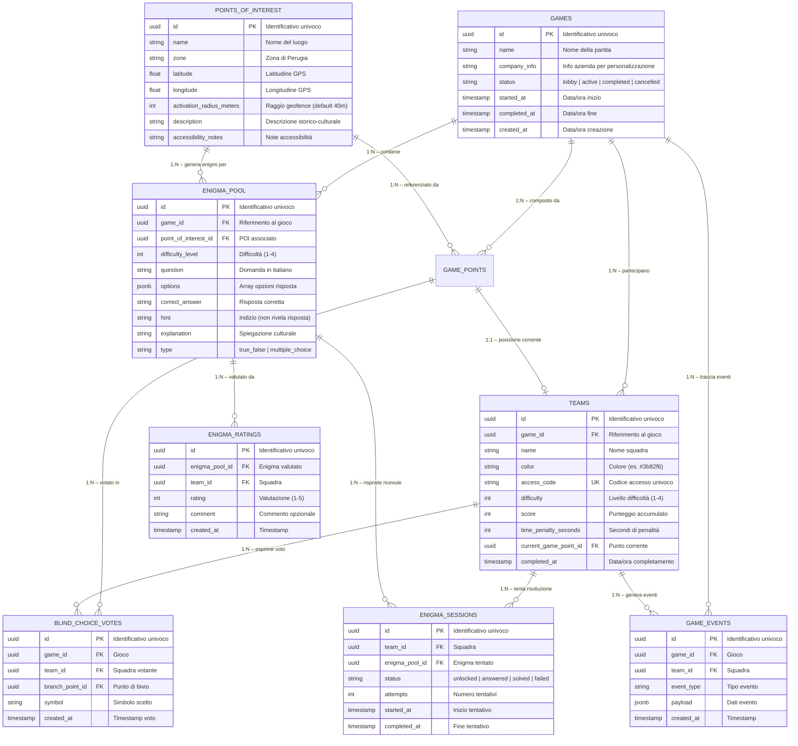

---

### 3. Activity Diagram

#### 3.1 Flusso Principale: Risposta all'Enigma (US3)

Questo diagramma modella il flusso completo dalla navigazione GPS all'avanzamento nel gioco, includendo i percorsi alternativi (risposta errata, bivio, completamento).

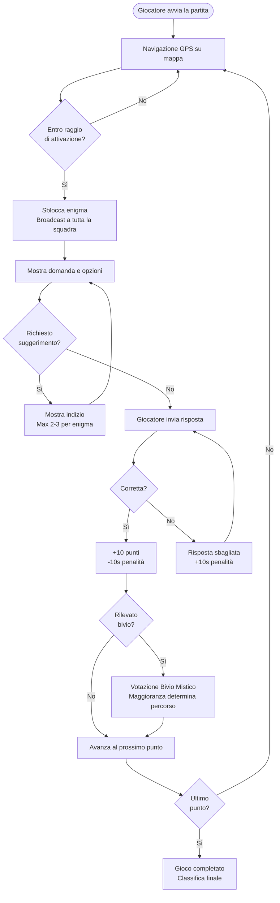

#### 3.2 Flusso Operatore: Creazione Gioco (US5)

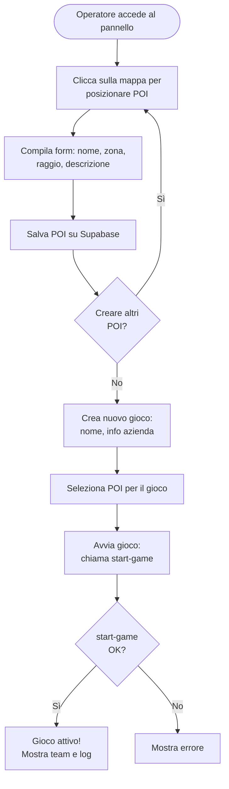

---

### 4. Sequence Diagram

#### 4.1 Sequenza: Risposta Enigma (US3)

Il diagramma mostra l'interazione temporale tra i componenti di sistema quando un giocatore risponde a un enigma.

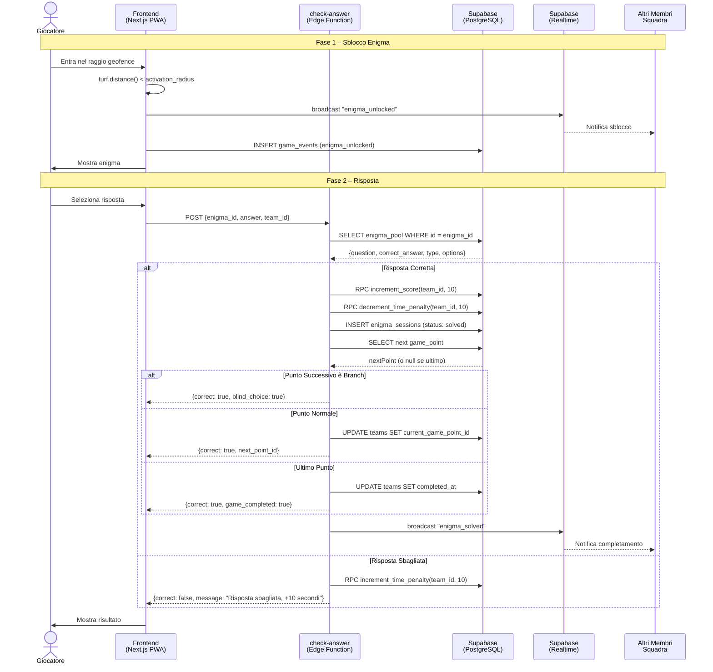

#### 4.2 Sequenza: Bivio Mistico (US33)

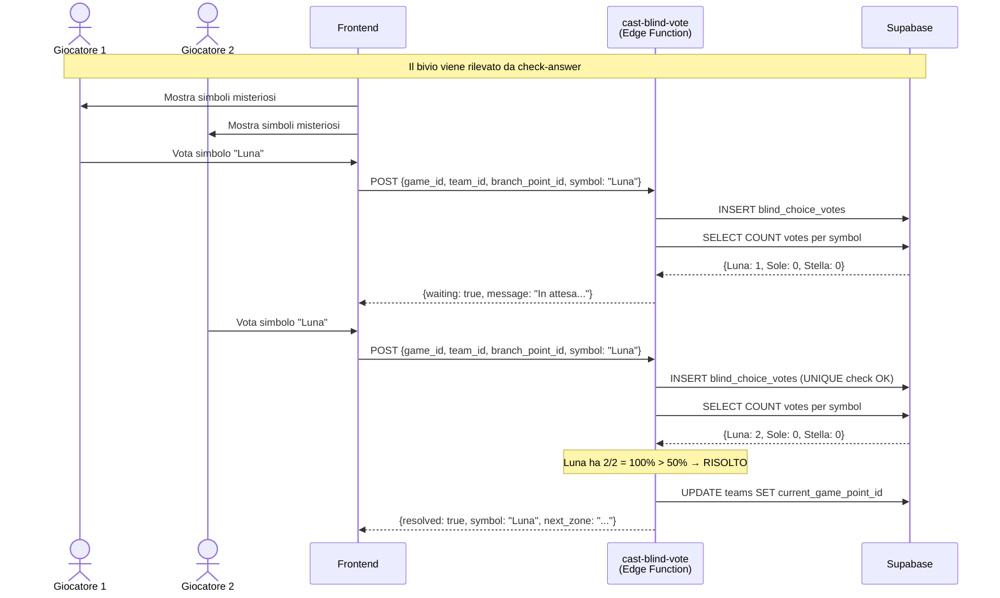

---

### 5. State Machine Diagram

#### 5.1 Stati di una Sessione Enigma (`enigma_sessions`)

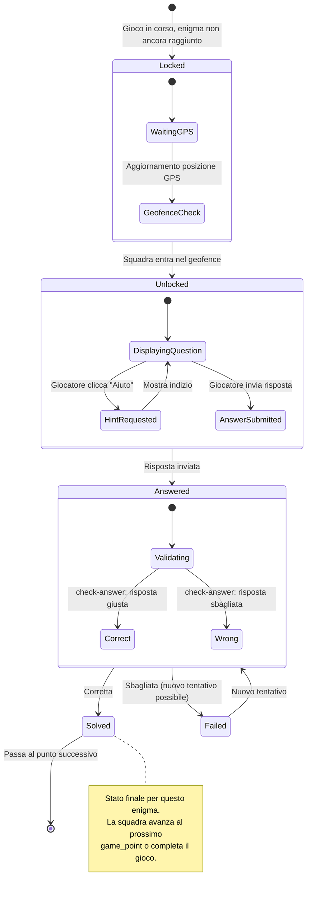

#### 5.2 Stati di una Partita (`games`)

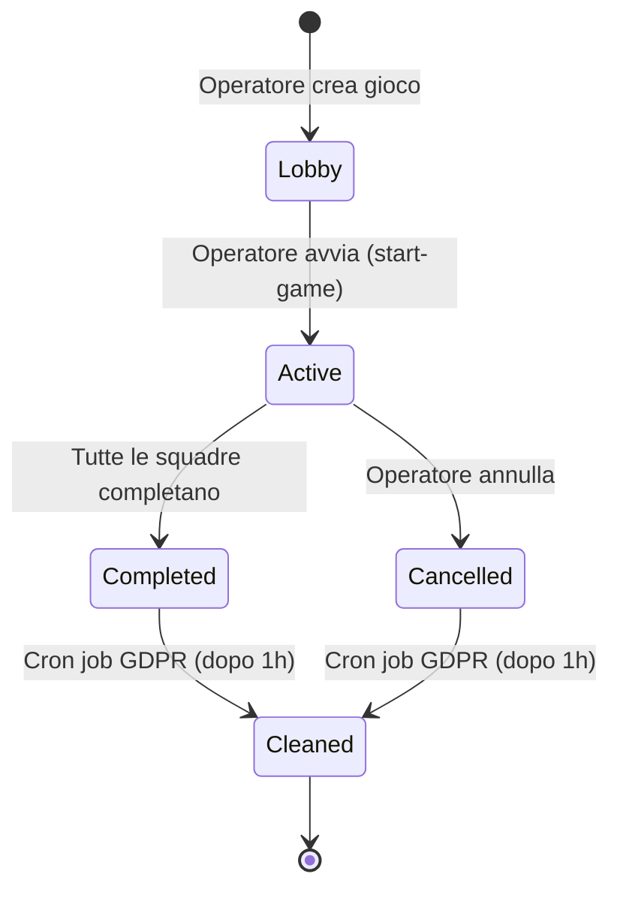

---

### 6. Component Diagram

Il diagramma mostra l'architettura a componenti del sistema, evidenziando le dipendenze tra moduli frontend, backend e servizi esterni.

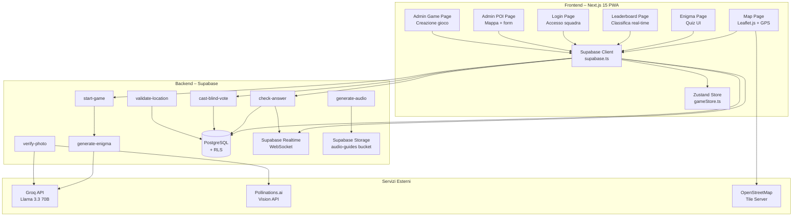

---

### 7. Deployment Diagram

Il diagramma mostra la distribuzione fisica dei componenti sui nodi di hosting.

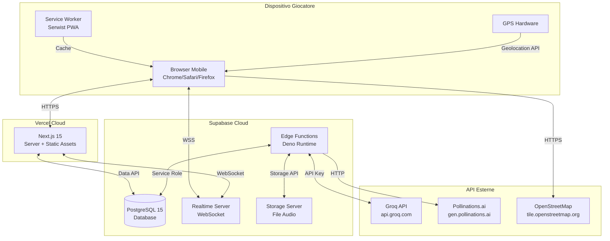

---

### Note di Implementazione

- Tutti i diagrammi sono realizzati in **Mermaid.js**, renderizzabili nativamente su GitHub, GitLab e qualsiasi visualizzatore Markdown compatibile.
- I diagrammi UML seguono le specifiche **UML 2.5**, adattate al contesto del progetto.
- Il caso d'uso principale scelto per Activity e Sequence Diagram è **"Risposta all'Enigma" (US3)**, in quanto rappresenta il flusso centrale dell'intera applicazione.
- L'oggetto scelto per lo State Machine Diagram è **`enigma_sessions`**, che traccia lo stato di ogni enigma per ogni squadra (dalla lobby alla risoluzione).
- Il Component Diagram evidenzia l'architettura a **microservizi** (7 Edge Function indipendenti) orchestrati dal frontend.
- Il Deployment Diagram riflette l'infrastruttura reale: **Vercel + Supabase + API esterne**.

---

*Documento redatto dal Gruppo di Lavoro Escape Room Perugia per AS GAIA.*
*Ultimo aggiornamento: 20 Maggio 2026*
