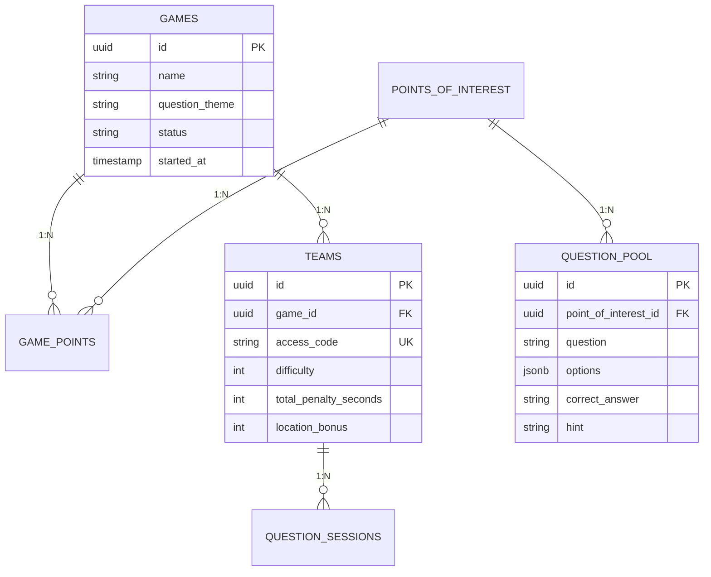

# Software Requirements Specification (SRS)
## Escape Room Outdoor -- Perugia

---

**Documento:** SRS-001
**Versione:** 3.1
**Data:** 4 Giugno 2026
**Committente:** AS GAIA (www.asgaia.it)
**Team:** Escape Room Perugia
**Metodologia:** Agile (Scrum)

---

### Indice

1. [Introduzione](#1-introduzione)
2. [Descrizione Generale](#2-descrizione-generale)
3. [Requisiti Specifici](#3-requisiti-specifici)
4. [Modello del Dominio](#4-modello-del-dominio)
5. [Criteri di Accettazione](#5-criteri-di-accettazione)
6. [Appendici](#6-appendici)

---

### 1. Introduzione

#### 1.1 Scopo

Il presente documento definisce i requisiti software per il sistema **"Escape Room Outdoor -- Perugia"**, un'applicazione mobile-first che trasforma il centro storico di Perugia in un'esperienza di gioco interattiva a squadre. I partecipanti, organizzati in squadre con punti di partenza casuali, navigano tramite GPS, rispondono a domande in stile Kahoot quando entrano nel raggio di luoghi di interesse, e competono simultaneamente in una gara a cronometro.

Il software e commissionato dall'azienda **AS GAIA** per attivita di team building e turismo esperienziale.

Questo SRS e redatto secondo lo standard **IEEE 830-1998** e i criteri di qualita di Sommerville: correttezza, completezza, non ambiguita, consistenza, verificabilita, modificabilita, tracciabilita.

#### 1.2 Ambito del Prodotto

| Componente | Descrizione | Tecnologia |
|------------|-------------|------------|
| **PWA Giocatore** | Progressive Web App per dispositivi mobili: navigazione GPS, sblocco domande via geofence, risposta a tempo, classifica in tempo reale, recupero GPS. | Next.js, React, Leaflet.js, Tailwind CSS/DaisyUI, Zustand |
| **Pannello Operatore** | Interfaccia desktop per la persona che gestisce l'escape room il giorno dell'evento: posizionamento POI su mappa, scelta tema domande, creazione squadre, avvio/stop partita, monitoraggio in tempo reale. Progettato per utenti non tecnici. | Next.js (stessa codebase) |
| **Backend Serverless** | Logica di gioco, generazione domande, validazione risposte con timer, comunicazione real-time, anti-cheat GPS, calcolo classifica a tempo. | Supabase (PostgreSQL, Edge Functions/Deno, Realtime, Storage) |

**Fuori dall'ambito:** app native, social network, pagamenti, AR, persistenza dati post-partita.

#### 1.3 Definizioni

| Termine | Definizione |
|---------|-------------|
| **PWA** | Progressive Web Application -- app web installabile con supporto offline |
| **Geofencing** | Area virtuale circolare (raggio 30-50m) intorno a coordinate GPS |
| **RLS** | Row Level Security -- sicurezza a livello di riga PostgreSQL |
| **Edge Function** | Funzione serverless Deno/TypeScript su Supabase |
| **Bivio Mistico** | Votazione al buio su simboli per scegliere il percorso successivo |
| **POI** | Point of Interest -- punto geolocalizzato sulla mappa di gioco |
| **LLM** | Large Language Model -- Groq Llama 3.3 70B per generazione domande |

#### 1.4 Riferimenti

| Rif. | Documento |
|------|-----------|
| [1] | RTM.md -- Requirements Traceability Matrix |
| [2] | UML.md -- UML Design Document |
| [3] | USERSTORY.md -- 33 User Stories |
| [4] | DOCUMENTAZIONE_TECNICA.md -- Documentazione tecnica |
| [5] | SPECIFICA_CLIENTE.md -- Specifica committente |
| [6] | PIANO_SVILUPPO.md -- Piano di sviluppo |

---

### 2. Descrizione Generale

#### 2.1 Prospettiva del Prodotto

Architettura 3-tier: PWA (presentazione), Edge Functions (logica), PostgreSQL con dati effimeri.

**Interfacce esterne:** Browser mobile con GPS, Groq API (domande), Pollinations.ai (foto), OpenStreetMap (mappe), Supabase (database + realtime).

#### 2.2 Funzionalita del Prodotto

| Macro-Funzione | Descrizione | US |
|----------------|-------------|-----|
| **Navigazione GPS** | Mappa interattiva; recupero automatico se il giocatore si allontana | US1, US7 |
| **Geofencing** | Sblocco domande a 30-50m | US2 |
| **Domande a Tempo** | 10s per rispondere; errore = +10s + nuova domanda diversa | US3, US6, US9, US29, US32 |
| **Scelta Tema** | Operatore sceglie: cultura generale / Perugia-Italia | US5 |
| **Gara a Cronometro** | Timer parte all'avvio, classifica per tempo | US4, US14, US15 |
| **Bonus Tappe** | -1s per tappa completata (max -5s) | US29 |
| **Partenza Casuale** | POI diverso per ogni squadra | US31 |
| **Bivio Mistico** | Voto al buio, maggioranza, spareggio | US28, US33 |
| **Verifica Foto** | Foto monumento, risposta entro 3s | US25 |
| **Audio-Guida** | Narrazione automatica (max 60s) | US26 |
| **Anti-Cheat GPS** | Velocita >50 m/s = sospetto | US19 |
| **Classifica Effimera** | Solo durante la partita, nessun dato salvato dopo | US4, US22 |
| **Pannello Operatore** | Per la persona che gestisce l'evento | US5, US10, US13 |
| **Login Atmosferico** | Sfondo Perugia, animazione porta | US30 |

#### 2.3 Caratteristiche degli Utenti

| Ruolo | Descrizione | Competenze |
|-------|-------------|------------|
| **Giocatore** | Partecipa: naviga, risponde, interagisce | Nessuna tecnica |
| **Caposquadra** | Configura nome, colore, difficolta | Base |
| **Operatore** | Gestisce l'evento: POI, squadre, avvio/stop, monitoraggio | Familiarita base con web e mappe |

#### 2.4 Vincoli

| Categoria | Vincolo |
|-----------|---------|
| **Stack** | Next.js 16, React 19, Tailwind 4, DaisyUI 5, Leaflet.js, Zustand, Supabase |
| **Lingua** | Italiano |
| **Hosting** | Vercel (frontend), Supabase Cloud (backend) |
| **Metodologia** | Agile (Scrum), Trello, Git flow |
| **Partita Singola** | Una partita attiva per volta; parte quando tutte le squadre sono entrate |

#### 2.5 Assunzioni

| # | Assunzione | Impatto se assente |
|---|-----------|-------------------|
| A1 | Dispositivo con GPS e internet | Gioco non funzionante |
| A2 | Groq API entro 5s | Fallback a placeholder |
| A3 | OpenStreetMap accessibile | Mappa non visibile (cache PWA) |
| A4 | Browser con Service Worker | Offline non disponibile |

---

### 3. Requisiti Specifici

#### 3.1 Requisiti Funzionali -- User Stories

**Priorita:** [Must] Must Have | [Should] Should Have | [Could] Could Have | [Wont] Non in questo sprint

##### Navigazione e Sblocco

| ID | User Story | Priorita |
|----|------------|----------|
| **US1** | Come giocatore, voglio vedere la mia posizione GPS su una mappa interattiva per orientarmi. | [Must] |
| **US2** | Quando la squadra entra nell'area di attivazione (30-50m), la domanda viene sbloccata per tutti i membri. | [Must] |
| **US7** | Se il GPS e assente, l'app mi avvisa. Se mi allontano dall'area obiettivo, il GPS mi guida per rientrare. | [Should] |

##### Domande e Risposte

| ID | User Story | Priorita |
|----|------------|----------|
| **US3** | Ho 10 secondi per rispondere. Se sbaglio: +10s di penalita e una **nuova domanda diversa**. Se corretto: passo alla tappa successiva e ottengo **-1s di bonus** sul tempo totale (massimo -5s cumulativi). | [Must] |
| **US6** | Come operatore, voglio che le domande siano generate automaticamente e siano tutte diverse per ogni squadra. | [Must] |
| **US9** | Posso chiedere un suggerimento se non capisco la domanda (max 2-3 per tappa). | [Should] |
| **US29** | Ogni tappa completata riduce il tempo totale di 1 secondo, fino a -5s massimi. | [Should] |
| **US32** | Ogni zona richiede 5 domande generate automaticamente. | [Must] |

##### Classifica e Competizione

| ID | User Story | Priorita |
|----|------------|----------|
| **US4** | Voglio vedere la classifica in tempo reale basata sul tempo totale. La classifica esiste solo durante la partita; nessun dato viene salvato dopo. | [Must] |
| **US14** | La classifica mostra la mia squadra evidenziata. | [Must] |
| **US15** | La classifica si aggiorna via WebSocket entro 2 secondi da ogni evento. | [Must] |

##### Meccaniche Avanzate

| ID | User Story | Priorita |
|----|------------|----------|
| **US8** | Quando un membro risolve, tutti i dispositivi della squadra ricevono l'aggiornamento entro 2s. | [Must] |
| **US25** | Scatto una foto al monumento per verifica automatica (risposta entro 3s). | [Should] |
| **US26** | All'arrivo in tappa, parte narrazione audio (max 60s) sulla storia del luogo. | [Could] |
| **US27** | Chat rapida di squadra per coordinarsi (messaggi cancellati a fine partita). | [Could] |
| **US28** | Dopo un bivio, la squadra sceglie tra percorsi diversi. | [Must] |
| **US33** | Bivio Mistico: tre simboli, votazione al buio, maggioranza decide; spareggio in parita. | [Must] |

##### Resilienza e Performance

| ID | User Story | Priorita |
|----|------------|----------|
| **US11** | L'app consuma poca batteria (polling GPS ogni 10s, cache). | [Could] |
| **US12** | Se l'app crasha, recupero la sessione alla riapertura. | [Should] |
| **US19** | Il sistema rileva spostamenti GPS sospetti (>50 m/s). | [Should] |
| **US21** | Tile mappa in cache; consumo dati < 5 MB/ora. | [Could] |
| **US22** | I dati esistono solo durante la partita; nessuna persistenza dopo. | [Must] |
| **US23** | Se internet cade, la domanda gia sbloccata rimane visibile offline. | [Could] |

##### Pannello Operatore

| ID | User Story | Priorita |
|----|------------|----------|
| **US5** | Come operatore, posiziono POI sulla mappa con un click, scelgo il tema domande (cultura generale / Perugia-Italia), creo le squadre e avvio la partita. | [Must] |
| **US10** | L'operatore crea le squadre, assegna codici di accesso univoci e imposta la difficolta (1-4). | [Must] |
| **US13** | L'operatore visualizza il log eventi in tempo reale per monitorare la partita. | [Should] |
| **US30** | Schermata di login con sfondo Perugia, form centrato, animazione porta. | [Must] |
| **US31** | Il caposquadra sceglie nome, colore, difficolta; il sistema assegna un punto di partenza casuale diverso per ogni squadra. | [Must] |

##### Futuro

| ID | User Story | Priorita |
|----|------------|----------|
| **US16** | Schermata regole punteggio. | [Wont] |
| **US17** | Badge e titoli squadre vincitrici. | [Wont] |
| **US18** | Schermata conclusiva con riepilogo. | [Wont] |
| **US20** | Percorsi accessibili senza barriere. | [Wont] |
| **US24** | Votazione domande per miglioramento. | [Wont] |

#### 3.2 Requisiti Non Funzionali

##### Performance

| ID | Requisito | Metrica |
|----|-----------|---------|
| NFR-P1 | Attivazione geofence | < 2s |
| NFR-P2 | Generazione domanda | < 5s |
| NFR-P3 | Verifica foto | < 3s |
| NFR-P4 | Aggiornamento classifica | < 2s |
| NFR-P5 | Timeout risposta | 10s |

##### Affidabilita

| ID | Requisito | Metrica |
|----|-----------|---------|
| NFR-R1 | Raggio GPS | 30-50m configurabili |
| NFR-R2 | Tolleranza GPS | +-15m |
| NFR-R3 | Fallback domande | Placeholder se Groq non risponde |

##### Sicurezza

| ID | Requisito |
|----|-----------|
| NFR-S1 | RLS su tutte le tabelle |
| NFR-S2 | Dati effimeri (solo durante partita) |
| NFR-S3 | Accesso via codice univoco |
| NFR-S4 | HTTPS obbligatorio |

##### Usabilita

| ID | Requisito |
|----|-----------|
| NFR-U1 | Design responsive (320px-1920px) |
| NFR-U2 | Pulsanti >= 44px (touch-friendly) |
| NFR-U3 | Feedback chiaro per ogni azione |
| NFR-U4 | Interfaccia in italiano |

#### 3.3 Requisiti di Dominio

| ID | Requisito |
|----|-----------|
| D1 | Gioco nel centro storico di Perugia |
| D2 | Domande: cultura generale o Perugia/Italia |
| D3 | Una partita attiva per volta |
| D4 | Partenza solo quando tutte le squadre sono entrate |
| D5 | Target: team building aziendale e turismo |
| D6 | Durata: 60-90 minuti, 5-7 tappe |
| D7 | 3-6 partecipanti per squadra |

#### 3.4 Casi d'Uso Testuali

**UC-1: Risposta a Domanda con Timer**

| Campo | Dettaglio |
|-------|-----------|
| **Nome** | Risposta a domanda a tempo |
| **Attore** | Giocatore (Primario) |
| **Precondizioni** | P1: Squadra all'interno del geofence (30-50m). P2: Domanda sbloccata per tutti i membri. P3: Timer partita attivo. P4: Almeno una domanda disponibile nel pool. P5: La squadra non ha ancora completato tutte le 5 domande della tappa. |
| **Flusso Principale (FL-01)** | 1. Il sistema mostra la domanda con 4 opzioni sul dispositivo del giocatore. 2. Il sistema avvia un countdown di 10 secondi visibile sullo schermo. 3. Il giocatore seleziona una risposta prima della scadenza. 4. Il sistema invia la risposta alla Edge Function `check-answer`. 5. L'Edge Function valuta la risposta e restituisce l'esito. 6a. [Corretta]: Il sistema applica -1s di bonus cumulativo (max -5s totali) e registra il completamento della domanda. 6b. [Corretta + ultima domanda]: La tappa e completata, la squadra riceve l'indicazione del prossimo POI. |
| **Flussi Alternativi** | |
| **FL-02: Risposta Sbagliata** (si innesta al passo 5 di FL-01) | 1. L'Edge Function rileva risposta errata. 2. Il sistema applica +10s di penalita al cronometro della squadra. 3. Il sistema seleziona una **nuova domanda diversa** dal pool (mai la stessa). 4. Si riprende da FL-01 passo 1 con la nuova domanda. |
| **FL-03: Timeout** (si innesta al passo 2 di FL-01) | 1. Il countdown raggiunge 0 senza risposta dal giocatore. 2. Il sistema tratta il timeout come risposta sbagliata. 3. Si applica +10s di penalita (come FL-02 passo 2). 4. Si genera una nuova domanda diversa (come FL-02 passo 3). 5. Si riprende da FL-01 passo 1. |
| **FL-04: Connessione Persa** (si innesta al passo 4 di FL-01) | 1. La chiamata a `check-answer` fallisce per timeout di rete. 2. Il sistema mostra un messaggio di errore "Connessione assente". 3. Il countdown viene messo in pausa. 4. Appena la connessione torna, il giocatore puo riprovare a inviare la risposta (il timer riprende dal valore in pausa). 5. Si riprende da FL-01 passo 4. |
| **Postcondizioni** | Successo: domanda completata, eventuale avanzamento tappa, bonus applicato. Insuccesso: penalita applicata, nuova domanda generata. |

**UC-2: Avvio Partita**

| Campo | Dettaglio |
|-------|-----------|
| **Nome** | Avvio partita dall'operatore |
| **Attore** | Operatore (Primario) |
| **Precondizioni** | P1: Almeno 2 squadre hanno effettuato il login con codice di accesso. P2: Almeno 5 POI sono stati posizionati sulla mappa. P3: Il tema delle domande e stato selezionato (cultura generale / Perugia-Italia). P4: Nessuna altra partita e attiva nel sistema. P5: Connessione a Groq API funzionante. |
| **Flusso Principale (FL-01)** | 1. L'operatore clicca il pulsante "Avvia Partita" nel pannello di controllo. 2. Il sistema verifica le precondizioni P1-P5. 3. Il sistema assegna a ogni squadra un POI di partenza casuale e diverso dalle altre. 4. Il sistema chiama `generate-enigma` in parallelo per generare 5 domande per ogni POI (tutte diverse tra squadre). 5. Il sistema avvia il cronometro globale della partita. 6. Il sistema notifica tutte le squadre via WebSocket: "La partita e iniziata!". 7. Ogni dispositivo mostra la mappa con il primo POI della propria squadra. |
| **Flussi Alternativi** | |
| **FL-02: Generazione Domande Fallita** (si innesta al passo 4 di FL-01) | 1. Groq API non risponde entro 5 secondi o restituisce errore. 2. Il sistema utilizza domande placeholder predefinite per il POI interessato. 3. L'operatore viene avvisato con un messaggio non bloccante: "Alcune domande usano il set di riserva". 4. Si riprende da FL-01 passo 5. |
| **FL-03: Squadre Insufficienti** (si innesta al passo 2 di FL-01) | 1. Il sistema rileva che meno di 2 squadre hanno effettuato il login. 2. Il pulsante "Avvia Partita" rimane disabilitato. 3. Un messaggio informa: "In attesa di almeno 2 squadre...". 4. FL-01 non puo proseguire; l'operatore attende. |
| **FL-04: Partita Gia Attiva** (si innesta al passo 2 di FL-01) | 1. Il sistema rileva una partita con stato `active` nel database. 2. Il sistema mostra un dialog: "C'e gia una partita in corso. Vuoi terminarla e iniziarne una nuova?". 3a. [Conferma]: Il sistema termina la partita corrente, azzera i dati, e riprende da FL-01 passo 3. 3b. [Annulla]: L'operatore torna al pannello senza avviare. |
| **Postcondizioni** | Partita in stato `active`; cronometro avviato; ogni squadra ha assegnato un POI iniziale diverso; 5 domande generate per ogni POI. |

**UC-3: Bivio Mistico -- Votazione al Buio**

| Campo | Dettaglio |
|-------|-----------|
| **Nome** | Bivio Mistico: votazione per scelta percorso |
| **Attore** | Giocatore (Primario) |
| **Precondizioni** | P1: La squadra ha raggiunto un punto di bivio designato sulla mappa. P2: Almeno 3 membri della squadra sono attivi. P3: Tre simboli sono stati generati dal sistema. |
| **Flusso Principale (FL-01)** | 1. Il sistema mostra tre simboli misteriosi a ogni membro della squadra. 2. Ogni membro vota **al buio** (non vede i voti altrui) selezionando un simbolo. 3. Il sistema raccoglie tutti i voti nella Edge Function `cast-blind-vote`. 4. Il sistema calcola il risultato: vince il simbolo con maggioranza >50%. 5. Il sistema rivela simultaneamente tutti i voti e il simbolo vincente. 6. La squadra procede verso il percorso associato al simbolo vincente. |
| **Flussi Alternativi** | |
| **FL-02: Parita** (si innesta al passo 4 di FL-01) | 1. Nessun simbolo raggiunge la maggioranza >50%. 2. Il sistema applica lo spareggio: elimina il simbolo con meno voti. 3. Se persiste parita tra due simboli, il sistema sceglie casualmente tra i due. 4. Si riprende da FL-01 passo 5. |
| **FL-03: Voto Singolo** (si innesta al passo 3 di FL-01) | 1. Solo un membro della squadra ha votato entro il timeout di 30s. 2. Il voto singolo viene accettato come maggioranza automatica. 3. Si riprende da FL-01 passo 5. |
| **FL-04: Timeout Votazione** (si innesta al passo 2 di FL-01) | 1. Trascorrono 30 secondi senza alcun voto. 2. Il sistema seleziona casualmente uno dei tre simboli. 3. Si riprende da FL-01 passo 5 con il simbolo casuale. |
| **Postcondizioni** | Simbolo vincente determinato; percorso successivo assegnato alla squadra. |

**UC-4: Sblocco Domanda via Geofence**

| Campo | Dettaglio |
|-------|-----------|
| **Nome** | Attivazione domanda all'ingresso nel raggio POI |
| **Attore** | Sistema (Secondario), Giocatore (Primario) |
| **Precondizioni** | P1: Partita in stato `active`. P2: La squadra ha un POI target assegnato. P3: GPS del dispositivo attivo con accuratezza < 20m. |
| **Flusso Principale (FL-01)** | 1. Il dispositivo invia la posizione GPS al backend ogni 3 secondi. 2. L'Edge Function `validate-location` calcola la distanza Haversine tra la posizione e il POI target. 3. Se la distanza e <= 50m, il sistema sblocca la prima domanda del POI per tutti i membri della squadra. 4. Il sistema invia una notifica push: "Sei arrivato! Rispondi alla domanda.". 5. Il dispositivo passa alla schermata domanda. |
| **Flussi Alternativi** | |
| **FL-02: Fuori Raggio** (si innesta al passo 3 di FL-01) | 1. La distanza calcolata e > 50m. 2. Il sistema non sblocca alcuna domanda. 3. La mappa continua a mostrare la navigazione verso il POI. 4. Si riprende da FL-01 passo 1 al prossimo invio GPS. |
| **FL-03: GPS Non Disponibile** (si innesta al passo 1 di FL-01) | 1. Il dispositivo non riesce a ottenere una posizione GPS (accuratezza > 50m o segnale assente). 2. Il sistema mostra un avviso: "GPS non disponibile. Avvicinati a un'area aperta.". 3. La domanda rimane bloccata. 4. Si riprende da FL-01 passo 1 quando il GPS torna disponibile. |
| **FL-04: Velocita Sospetta** (si innesta al passo 2 di FL-01) | 1. Il sistema rileva uno spostamento >50 m/s tra due invii consecutivi. 2. Il sistema flagga il movimento come sospetto (anti-cheat). 3. La domanda non viene sbloccata anche se la posizione e nel raggio. 4. Dopo 3 flag consecutivi, l'operatore riceve una notifica. 5. Si riprende da FL-01 passo 1. |
| **Postcondizioni** | Domanda sbloccata e visibile a tutti i membri della squadra; oppure navigazione verso il POI continua. |

**UC-5: Verifica Foto del Monumento**

| Campo | Dettaglio |
|-------|-----------|
| **Nome** | Scatto e verifica foto al monumento |
| **Attore** | Giocatore (Primario) |
| **Precondizioni** | P1: La squadra ha completato le 5 domande della tappa corrente. P2: Il POI corrente richiede verifica fotografica. P3: Fotocamera del dispositivo funzionante. |
| **Flusso Principale (FL-01)** | 1. Il sistema mostra l'istruzione: "Scatta una foto al monumento [Nome]". 2. Il giocatore scatta la foto tramite l'interfaccia dell'app. 3. L'immagine viene inviata alla Edge Function `verify-photo`. 4. L'Edge Function chiama Pollinations.ai per l'analisi visiva. 5. L'Edge Function chiama Groq per la verifica testuale del contesto. 6. Il sistema restituisce l'esito entro 3 secondi. 7a. [Verificata]: La tappa e completata, bonus -1s applicato. 7b. [Non verificata]: Il giocatore puo riprovare (max 3 tentativi). |
| **Flussi Alternativi** | |
| **FL-02: Foto Non Riconosciuta** (si innesta al passo 6 di FL-01) | 1. Pollinations.ai restituisce confidenza < 70%. 2. Il sistema mostra: "Foto non riconosciuta. Riprova con un'inquadratura migliore.". 3. Il contatore tentativi viene incrementato. 4a. [Tentativi < 3]: Si riprende da FL-01 passo 1. 4b. [Tentativi = 3]: La tappa viene considerata completata senza bonus. Si prosegue al POI successivo. |
| **FL-03: Timeout Verifica** (si innesta al passo 4 di FL-01) | 1. Pollinations.ai non risponde entro 3 secondi. 2. Il sistema effettua un retry singolo. 3a. [Secondo tentativo OK]: Si riprende da FL-01 passo 6. 3b. [Anche il secondo fallisce]: Il sistema approva automaticamente la tappa senza bonus. Si prosegue. |
| **FL-04: Fotocamera Non Disponibile** (si innesta al passo 2 di FL-01) | 1. Il browser non supporta `getUserMedia` o l'utente nega il permesso. 2. Il sistema mostra un'alternativa: "Carica una foto dalla galleria". 3. Il giocatore seleziona un'immagine esistente. 4. Si riprende da FL-01 passo 3. |
| **Postcondizioni** | Foto verificata e tappa completata con bonus; oppure tappa completata senza bonus dopo 3 tentativi falliti. |

---

### 4. Modello del Dominio

---

### 5. Criteri di Accettazione

| # | Criterio |
|---|----------|
| CA1 | Timer parte all'avvio operatore, si ferma al completamento o stop |
| CA2 | Ogni domanda ha timeout 10 secondi |
| CA3 | Errore = +10s + nuova domanda diversa |
| CA4 | Bonus -1s per tappa (max -5s) |
| CA5 | Squadre diverse: POI partenza diversi, domande diverse |
| CA6 | Classifica solo durante partita, dati azzerati dopo |
| CA7 | Operatore sceglie tra cultura generale e Perugia/Italia |
| CA8 | GPS guida verso area se giocatore si allontana |
| CA9 | Pannello operatore utilizzabile da personale non tecnico |
| CA10 | Tutte le 7 Edge Function deployate e funzionanti |

---

### 6. Appendici

#### 6.1 Stack Tecnologico

| Layer | Tecnologia |
|-------|-----------|
| Frontend | Next.js 16, React 19, Tailwind CSS 4, DaisyUI 5 |
| Mappe | Leaflet.js + React-Leaflet + OpenStreetMap |
| Stato | Zustand 5 |
| PWA | Serwist 9 |
| Backend | Supabase (PostgreSQL, Realtime, Storage, Edge Functions/Deno) |
| Generazione | Groq API (Llama 3.3 70B) |
| Visione | Pollinations.ai |
| Hosting | Vercel + Supabase Cloud |
| Strumenti | VS Code, Git, Trello |

#### 6.2 Glossario

| Termine | Definizione |
|---------|-------------|
| Geofencing | Area virtuale circolare intorno a coordinate GPS |
| Bivio Mistico | Votazione al buio su simboli |
| Edge Function | Funzione serverless Deno/TypeScript su Supabase |
| PWA | Progressive Web App installabile |
| Haversine | Formula distanza tra coordinate GPS |
| Cronometro di Partita | Timer globale, parte all'avvio, stop a completamento |

---

*Documento redatto dal Team Escape Room Perugia per AS GAIA -- 4 Giugno 2026*
