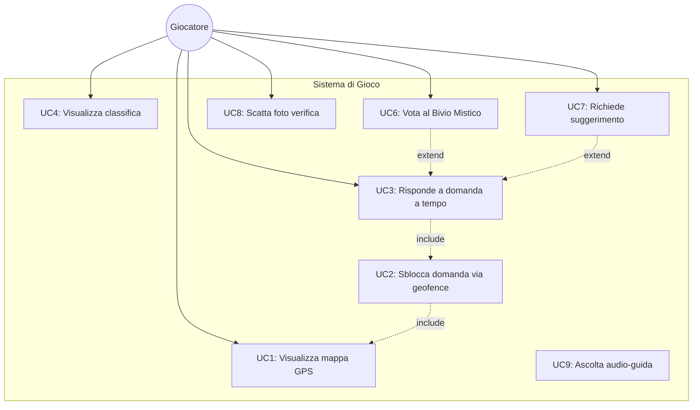
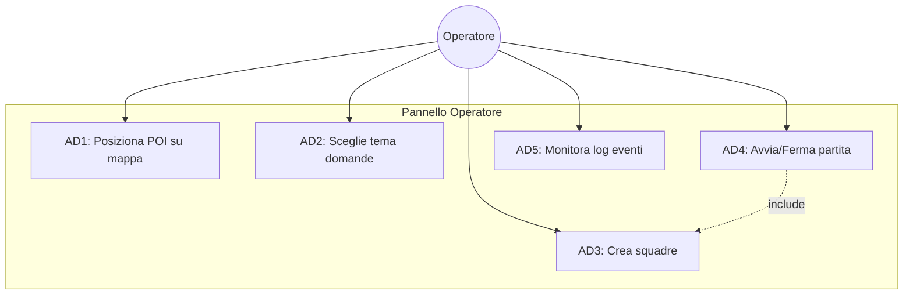
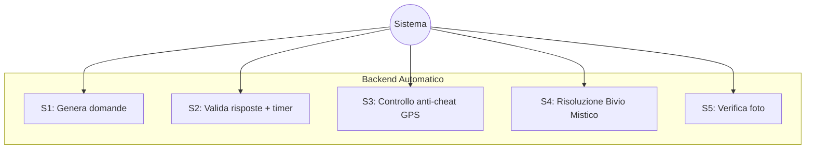
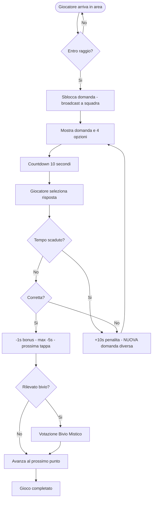
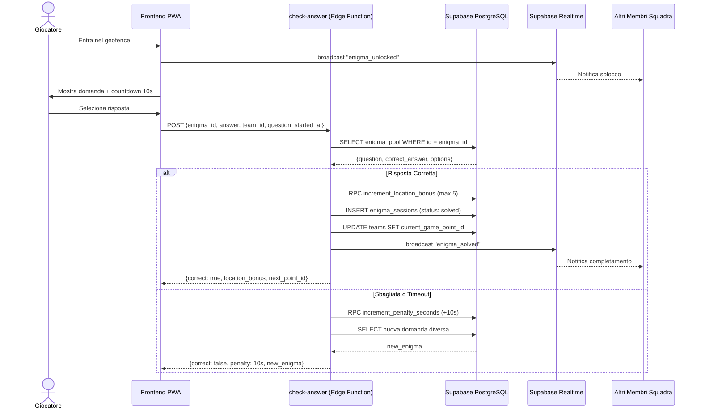
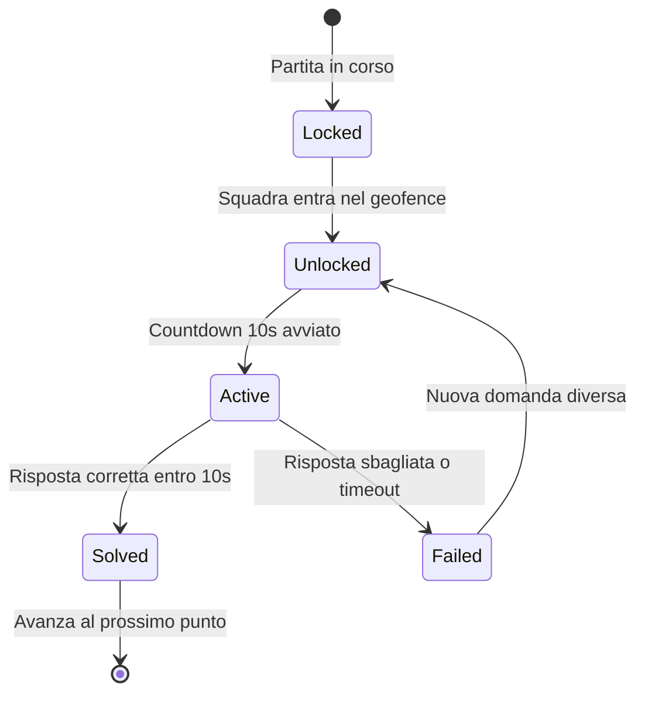
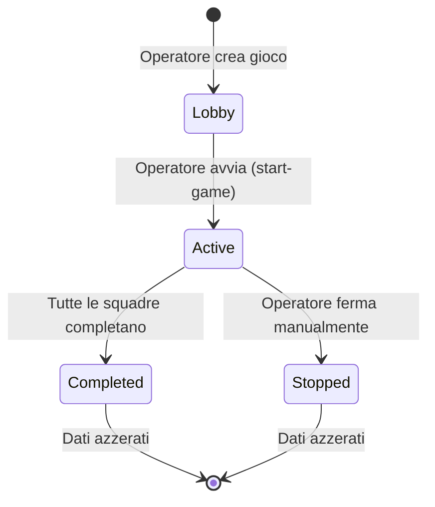
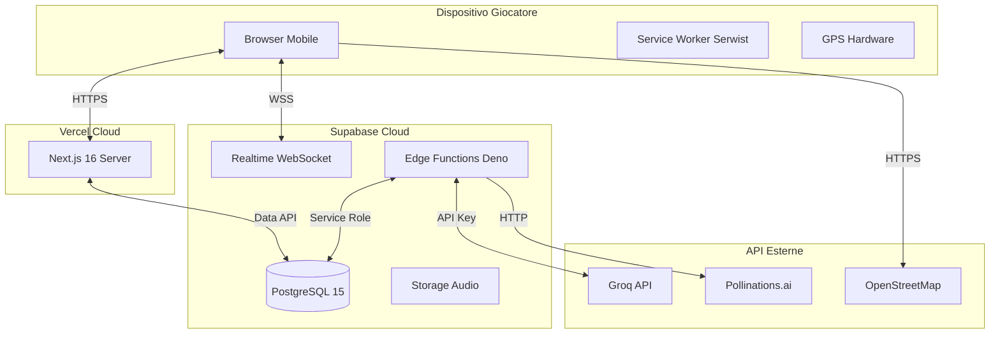

# UML Design Document
## Escape Room Outdoor -- Perugia

**Documento:** UML-001 | **Versione:** 3.1 | **Data:** 4 Giugno 2026

> **Riferimento incrociato:** I Casi d'Uso testuali completi (UC-1..UC-5) con precondizioni, flusso principale numerato e flussi alternativi sono documentati in `SRS.md` Sezione 3.4.

---

### 1. Use Case Diagrams

#### 1.1 Giocatore

#### 1.2 Operatore

#### 1.3 Sistema (Backend Automatico)

---

### 2. Activity Diagram: Risposta a Domanda (US3)

---

### 3. Sequence Diagram: Risposta a Domanda (US3)

---

### 4. State Machine: Sessione Domanda (enigma_sessions)

---

### 5. State Machine: Partita (games)

---

### 6. Deployment Diagram

---

*Documento redatto dal Team Escape Room Perugia -- 4 Giugno 2026*
